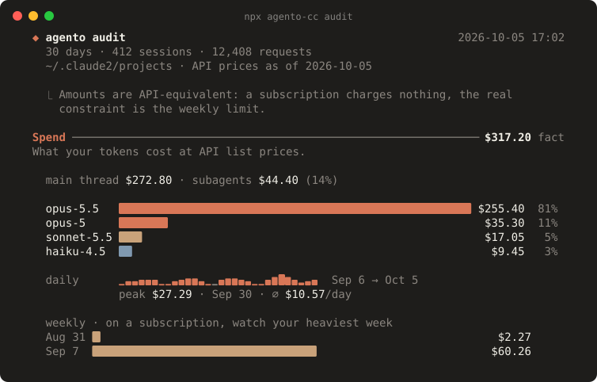
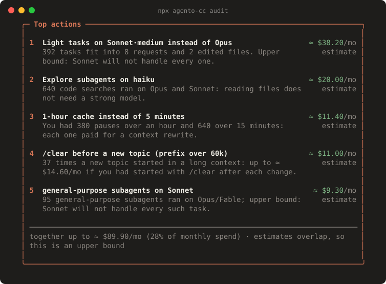
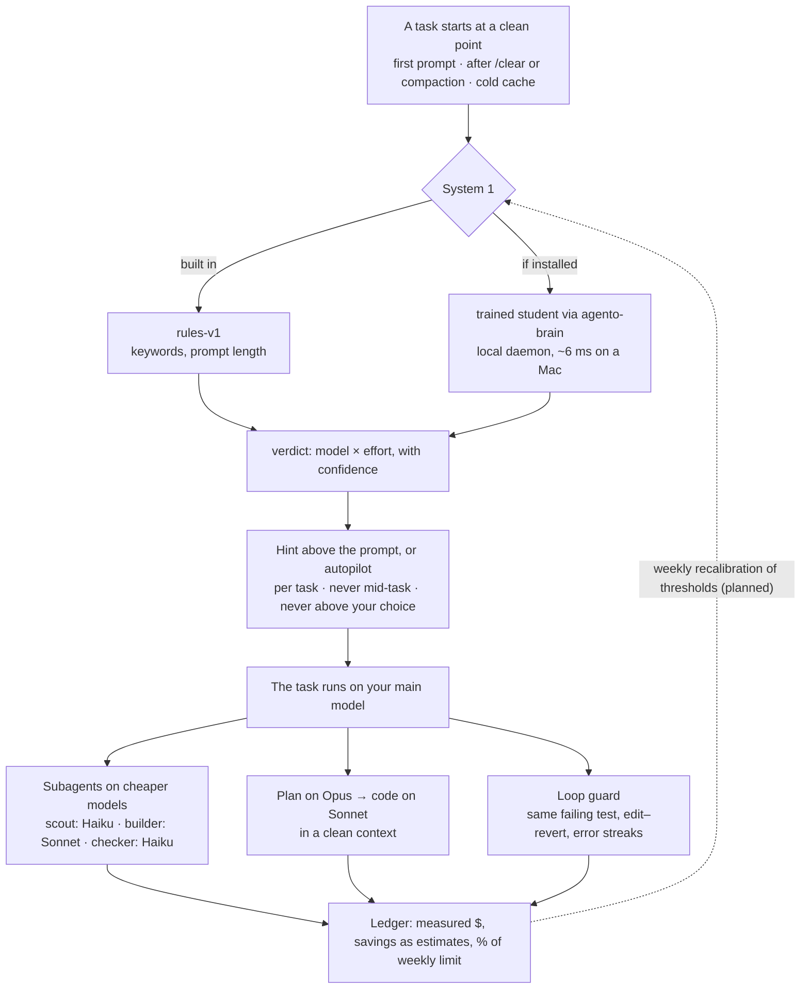
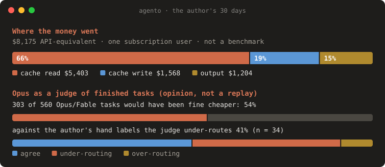

<div align="center">

# ◆ agento

**Spend less of your Claude Code budget — without losing quality.**

A “System 1” for Claude Code: it right-sizes the model at the start of a task, sends cheap work to cheap subagents,
hands architecture from Opus to Sonnet in a clean context, and stops agents that are going in circles.
Everything is measured in dollars (or % of your weekly limit), locally.

[](LICENSE)
[](package.json)
[](https://code.claude.com/docs/en/plugins/mods/overview)
[](#roadmap)

[Website](https://regksemx.github.io/agento/) · [How it works](https://regksemx.github.io/agento/how-it-works.html) · [Benchmarks](https://regksemx.github.io/agento/benchmarks.html) · [Русская версия](README.ru.md)

</div>

<p align="center"></p>
<p align="center"></p>
<p align="center"><sub>Both screenshots are rendered from a synthetic sample report (<code>scripts/readme-svg.ts</code>), not from real data.</sub></p>

> **Status: alpha.** `agento audit` and the plugin work today. The first trained classifier exists, and its own report says it must not pick the model alone yet ([below](#benchmarks)).

## Contents

[60-second tour](#60-second-tour) · [How it works](#how-it-works) · [Why: the economics](#why-the-economics) · [Quick start](#quick-start) · [Commands](#commands) · [What it does](#what-it-does) · [Benchmarks](#benchmarks) · [Principles](#principles) · [Privacy](#privacy) · [FAQ](#faq) · [Roadmap](#roadmap) · [Contributing](#contributing) · [License](#license)

## 60-second tour

agento shows up in three places. The mock-ups below use the plugin's real strings; the amounts are illustrative.

**1. The status line.** Model and effort, spend, and whether the main cache is still warm (`●`) or cold (`○`). Subscribers see their 7-day limit instead of dollars.

```text
◆ agento · opus·high · $1.84 · cache ● 41m
◆ agento · sonnet·med · 7d 63% · cache ● 41m
```

**2. The banner above the prompt.** At most one, only at the start of a task, always with a reason and an estimate.

```text
> fix the typo in the README heading
────────────────────────────────────────────────────────────────────────────
◆ Looks like a light task
  sonnet·medium is enough here (now opus·max). Why: light-task words ×2, short prompt (34 chars).
  Switching early in a task is cheap: the cache is empty or still small.
  ≈ −$0.40 on a task like this · estimate
  [Sonnet]  [Effort medium]  [Keep]  [Don't suggest]
```

**3. The `/agento` pane.** Measured spend, agento's savings (always marked as an estimate), hints, loops, and which classifier is active.

```text
 ◆ agento · session 1h12m                                     mode: balanced
 ───────────────────────────────────────────────────────────────────────────
 Spend        $6.71 measured   cache hit 94% · ● warm 41m
 Models       opus ▇▇▇▇░░░░░░ 31   sonnet ▇▇▇▇▇▇▇▇▇▇ 84   haiku ▇▇▇░░░░░░░ 27
 Savings      ≈ $2.12  (subagents $1.30 · hints $0.82)   estimate
 Hints        4 shown · 2 accepted · 1 "don't suggest"
 Loops        1 (test failing for the 3rd time: auth.spec)
 Classifier   rules-v1 · local
 ───────────────────────────────────────────────────────────────────────────
 [Mode]  [Orchestra: off]  [Autopilot: off]
```

## How it works



agento is a Claude Code plugin with in-process hooks (`prompt.submit`, `turn.step`, `agent.spawn`, `tool.call`, `ui`). It makes **one decision per task, at a clean point**, where changing the model costs nothing, and otherwise stays out of the way. The full mechanics, with diagrams: [How it works](https://regksemx.github.io/agento/how-it-works.html).

## Why: the economics

- **The bill is cache, not tool output.** In an independent SWE-bench study, 87% of a Claude Code bill was prompt cache (44% writes, 35% reads); output was 10%, tool output and file reads about 6% (["Token Reduction Is Not Cost Reduction"](https://arxiv.org/abs/2607.12161)).
- **A mid-task switch rewrites the whole cache.** The cache does not carry over between models. On a 100k context, Opus 5.5 → Sonnet 5.5 writes 100k × $2.50/M = $0.25 instead of a $0.02 read: **+$0.23 once**. Opus 5.5 and Sonnet 5.5 read the cache at the same price, so Sonnet saves only ~$0.0225 a step and the switch pays off after **~10 steps**, if Sonnet needs no extra ones.
- **“Token compression” can raise the bill.** In the same study one compressor raised the total cost by 48% and another by 6.8%: compressed context broke edit anchors, agents re-read files, and every extra step re-reads the whole prefix.

So agento pays attention to **model × effort × cache stability**, picks models where the cache is empty anyway (task start, after `/clear`, subagents), and measures **billed dollars per resolved task**.

## Quick start

See where your budget goes. It reads your local Claude Code transcripts and sends nothing anywhere (Node ≥ 20):

```sh
npx agento-cc audit            # last 30 days
npx agento-cc audit --since all --md report.md
```

Install the plugin (Claude Code ≥ 2.1.287):

```text
/plugin marketplace add regksemx/agento
/plugin install agento@agento
```

Optional: **the local classifier** (`agento-brain`, Python ≥ 3.11). The plugin works without it on built-in rules; with it, the plan-first and explore-first hints come from a small trained model, answered in a few milliseconds on your CPU. Nothing leaves the machine.

```sh
uv tool install "agento-brain @ git+https://github.com/regksemx/agento#subdirectory=brain"
agento-brain fetch      # the published model (262 MB, checksum verified)
agento-brain install    # writes a launchd/systemd unit and prints the command that starts it
```

The published model, `opus-v1`, does not pick the model for a task yet: its tier head failed its own safety bar, so the rules keep that decision ([why](https://regksemx.github.io/agento/benchmarks.html)).

Also optional: **train your own System 1** on your history — dataset → judge on your GPU → Laya teacher → multilingual-e5-small student → `agento-brain`. Step by step: [docs/runbook-gpu.md](docs/runbook-gpu.md) (in Russian).

## Commands

`agento` below is the CLI (`npx agento-cc …`).

| Command | What it does |
|---|---|
| `agento audit [--since 30d\|all] [--md file] [--json]` | Spend, cache misses and their causes, TTL, light tasks on expensive models, subagents, dead context, setup |
| `agento dataset build` | Cuts transcripts into tasks with features and weak (L0) labels; scrubs secrets → `~/.agento/dataset/tasks.jsonl` |
| `agento dataset judge` | L1 labels: a judge reads each finished task — any OpenAI-compatible server (e.g. vLLM) or `claude -p` |
| `agento dataset label` | You label a sample of your own past tasks in the terminal; used as gold for calibration |
| `agento dataset replay` | L2 labels: re-runs past tasks on cheaper setups in a git worktree (spends your limit; takes `--budget-usd`) |
| `agento dataset import twinrouterbench` | Public verified-tier labels from TwinRouterBench (Apache-2.0) |
| `agento dataset validate-judge` | Compares a judge with the public labels: accuracy, under-routing, threshold sweep |
| `/agento [mode\|autopilot\|orchestrate\|new] [value]` | The pane and the settings, inside Claude Code |
| `/agento:tune` | A skill that proposes a slimmer CLAUDE.md and setup from the audit's numbers; applies nothing without your OK |

## What it does

| | Scenario | How it saves |
|---|---|---|
| 🎯 | **Right model for the task** — a light task on Opus/`max` effort gets a one-click "Sonnet · medium" suggestion when the task starts | Chosen before the cache warms up, so switching is free |
| 🏛 | **Architect → builder** — discuss architecture with Opus in plan mode, then code on Sonnet in a fresh context with only the plan | Sonnet starts with ~5–10k tokens instead of 100k+ of discussion |
| 🎼 | **Orchestra of subagents** — scout (Haiku) reads and searches, builder (Sonnet) implements, checker (Haiku) runs tests | Subagents have their own cache; the main thread stays lean |
| 🧹 | **Context hygiene** — a new topic in a long context gets a "/clear first" hint with its per-step cost | Dead context stops being re-read on every step |
| 🔁 | **Loop guard** — the same failing test three times, or edit–revert cycles, raise a flag | A stuck agent is the most expensive agent |
| 📊 | **Ledger** — what you spent, what agento saved, cache warmth, weekly-limit pace in the status line | You see the money, not token counts |

## Benchmarks

<p align="center"></p>

**One user's data, not a benchmark.** The author's own 30 days of Claude Code (one subscription user, 408 sessions, API-equivalent prices):

- **66%** of spend was **cache reads**; cache hit ratio 99.2%.
- An **Opus judge** reading finished tasks said **303 of 560 (54%)** Opus/Fable tasks would have been fine on Sonnet or Haiku. That is the judge's opinion, not a replay — and against the author's hand labels the same judge **under-routes 41%** of the time (n = 34).
- **First training run (`opus-v1`).** From the prompt alone the student cannot pick the model safely (no threshold keeps under-routing ≤ 5%), so it never acts on its own for the tier. Its plan-first (92%) and delegate-explore (76%) heads are used by the plugin: plan-first brings up the Opus planning hint, explore-first tells the agent to start with `agento-scout` when orchestrator mode is on. Next: decide after the first steps, when trajectory signals exist.

All charts with their caveats: [Benchmarks](https://regksemx.github.io/agento/benchmarks.html) (data: [`site/data/`](site/data/); chart: `node scripts/bench-svg.ts > docs/assets/bench.svg`). A public benchmark of cost per resolved task is on the [roadmap](#roadmap).

## Principles

1. **Never switch the main model mid-task.** The prompt cache does not carry over between models: a switch on a 100k context costs ~$0.23 extra and pays off only after ~10 steps. agento picks models at clean points only — session start, after `/clear` or compaction, cold cache — and in subagents.
2. **Never above your choice.** agento will not raise the model or effort you picked.
3. **Nothing silently.** Every hint shows its reason and an estimate; every automatic action is visible and reversible.
4. **Fail-open.** If agento errors or times out, Claude Code behaves as if it were not installed.
5. **Dollars, not tokens.** Independent studies show "token compression" can *raise* the bill; we measure billed cost per resolved task.

Why: [an independent study](https://arxiv.org/abs/2607.12161) — 87% of a Claude Code bill is prompt cache, not tool output. All seven principles with examples: [How it works](https://regksemx.github.io/agento/how-it-works.html#principles).

## Privacy

`agento audit` and the plugin run locally. No prompts, code or usage leave your machine. A future hosted classifier will be opt-in and receive only compact features.

Training is opt-in too: the judge talks only to the server you point it at, and the scrubbed dataset goes only to a GPU box you own. Your data never ends up in public weights.

## FAQ

<details>
<summary><b>Does it work on Pro/Max subscriptions?</b></summary>

Yes. A subscription charges nothing per token, but the weekly limit runs out. The audit shows API-equivalent amounts; the plugin shows your 7-day limit in the status line and, once calibrated on your own history, phrases hints as "≈ −0.6% of the weekly limit". The calibration is an empirical estimate and is labelled as such.
</details>

<details>
<summary><b>Does it send my code anywhere?</b></summary>

No. The audit and the plugin read local files and run locally. The only network traffic is the training you start yourself: the judge you point at a server, and the scrubbed dataset sent to your own GPU box.
</details>

<details>
<summary><b>Will it switch models mid-task?</b></summary>

Never. The main model changes only at a clean point (first prompt, after `/clear` or compaction, cold cache). Autopilot is off by default; when on, it holds the cheaper setup for that one task and never runs `/model`, which would also change your default for every new session.
</details>

<details>
<summary><b>What if it's wrong?</b></summary>

A hint is one click to ignore; "Don't suggest" turns that kind off for the project. An autopilot choice comes with a `[Back to opus·max]` button. agento never goes above your choice, the loop guard flags a stuck agent, and any error makes it step aside. A trained model ships only if it under-routes in at most 5% of held-out tasks — the first one did not, so for the model choice it only hints.
</details>

<details>
<summary><b>What does it cost?</b></summary>

Nothing: Apache-2.0. The rules and the local student make no API calls. Judging your history costs a little with `claude` as the judge, or nothing on your own vLLM server; replays spend real limit, are opt-in and take `--budget-usd`.
</details>

## Roadmap

- [x] Research and design
- [x] `agento audit` — spend, cache misses, TTL, light tasks on expensive models, subagents, dead context, setup
- [x] Plugin MVP — ledger, status line, subagent routing, loop guard, hints, plan → code handoff, `/agento` pane, autopilot at clean points
- [x] Training pipeline — dataset from your history, L1 judge (any OpenAI-compatible server), replays, public TwinRouterBench labels, [Laya](https://github.com/NandhaKishorM/laya) teacher → multilingual-e5-small student (8.1 ms at 128 tokens on the training box CPU; the installed daemon answers in ~6 ms on an Apple-silicon Mac), `agento-brain` daemon
- [x] First training run (`opus-v1`): plan-first and delegate-explore heads in use; the model choice stays with the rules
- [ ] Decide after the first steps of a task, when trajectory signals exist
- [ ] Trained System 1 shipped by default instead of rules ([runbook](docs/runbook-gpu.md))
- [ ] Public benchmark: cost per resolved task vs always-Opus, opusplan, rule routers

## Contributing

Issues and pull requests are welcome. How the pieces fit: [How it works](https://regksemx.github.io/agento/how-it-works.html). Keep the [principles](#principles) intact, and never commit real transcripts: the README and site images come from synthetic data.

```sh
npm install
npm test                 # unit tests (vitest)
npm run typecheck
npm run build && node cli/dist/agento.mjs audit
claude plugin validate plugin && claude plugin test plugin
```

The website is static and lives in [`site/`](site/) (no build step; the figures are regenerated from `site/data/` with `node scripts/site-figures.ts`); `.github/workflows/pages.yml` publishes it to GitHub Pages. Preview it with `python3 -m http.server -d site`.

## License

Apache-2.0. agento is an independent project, not affiliated with or endorsed by Anthropic.
