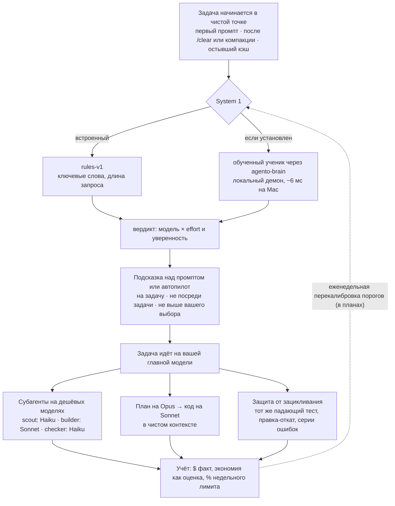
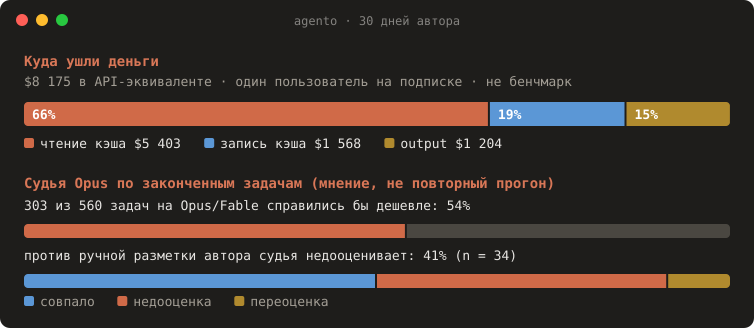

<div align="center">

# ◆ agento

**Тратьте меньше бюджета Claude Code — без потери качества.**

«System 1» для Claude Code. Подбирает модель на старте задачи и отдаёт дешёвую работу дешёвым субагентам.
Передаёт архитектуру от Opus к Sonnet в чистом контексте и останавливает агентов, которые ходят по кругу.
Всё считается в долларах или в процентах недельного лимита, локально.

[](LICENSE)
[](package.json)
[](https://code.claude.com/docs/en/plugins/mods/overview)
[](#дорожная-карта)

[Сайт](https://regksemx.github.io/agento/ru/) · [Как работает](https://regksemx.github.io/agento/ru/how-it-works.html) · [Бенчмарки](https://regksemx.github.io/agento/ru/benchmarks.html) · [English](README.md)

</div>

<p align="center"></p>
<p align="center"></p>
<p align="center"><sub>Оба скриншота отрисованы из синтетического примера отчёта (<code>scripts/readme-svg.ts</code>), а не из реальных данных.</sub></p>

> **Статус: альфа.** `agento audit` и плагин уже работают. Первый обученный классификатор есть, и его собственный отчёт говорит, что выбирать модель сам он пока не должен ([ниже](#бенчмарки)).

## Содержание

[Тур за минуту](#тур-за-минуту) · [Как работает](#как-работает) · [Почему: экономика](#почему-экономика) · [Быстрый старт](#быстрый-старт) · [Команды](#команды) · [Что делает](#что-делает) · [Бенчмарки](#бенчмарки) · [Принципы](#принципы) · [Приватность](#приватность) · [Вопросы](#вопросы) · [Дорожная карта](#дорожная-карта) · [Участие](#участие) · [Лицензия](#лицензия)

## Тур за минуту

agento появляется в трёх местах. Макеты ниже собраны из настоящих строк плагина; суммы условные.

**1. Строка статуса.** Модель и effort, расход и тёплый ли ещё кэш главного потока (`●`) или уже остыл (`○`). На подписке вместо долларов — недельный лимит.

```text
◆ agento · opus·high · $1.84 · cache ● 41m
◆ agento · sonnet·med · 7d 63% · cache ● 41m
```

**2. Полоса над промптом.** Не больше одной, только на старте задачи, всегда с причиной и оценкой.

```text
> исправь опечатку в заголовке README
────────────────────────────────────────────────────────────────────────────
◆ Похоже на лёгкую задачу
  Для такой задачи хватит sonnet·medium (сейчас opus·max). Причина: слова лёгкой задачи ×2,
  короткий запрос (35 симв.). Смена в начале задачи дёшева: кэш пуст или ещё мал.
  ≈ −$0.40 на такой задаче · оценка
  [Sonnet]  [Effort medium]  [Оставить]  [Не предлагать]
```

**3. Панель `/agento`.** Фактический расход, экономия механизмов agento (всегда с пометкой «оценка»), подсказки, буксование и активный классификатор.

```text
 ◆ agento · сессия 1h12m                                      mode: balanced
 ───────────────────────────────────────────────────────────────────────────
 Расход        $6.71 факт   кэш hit 94% · ● warm 41m
 Модели        opus ▇▇▇▇░░░░░░ 31   sonnet ▇▇▇▇▇▇▇▇▇▇ 84   haiku ▇▇▇░░░░░░░ 27
 Экономия      ≈ $2.12  (субагенты $1.30 · подсказки $0.82)   оценка
 Подсказки     4 показано · 2 принято · 1 «не предлагать»
 Буксование    1 (тест падает уже 3-й раз: auth.spec)
 Классификатор rules-v1 · локально
 ───────────────────────────────────────────────────────────────────────────
 [Режим]  [Оркестр: выкл]  [Автопилот: выкл]
```

## Как работает



agento — плагин Claude Code с хуками внутри процесса (`prompt.submit`, `turn.step`, `agent.spawn`, `tool.call`, `ui`). Он принимает **одно решение на задачу, в чистой точке**, где смена модели ничего не стоит, а в остальное время не мешает. Подробная механика со схемами: [Как работает](https://regksemx.github.io/agento/ru/how-it-works.html).

## Почему: экономика

- **Счёт — это кэш, а не вывод инструментов.** В независимом исследовании на SWE-bench 87% счёта Claude Code пришлось на кэш промптов (44% запись, 35% чтение); output — 10%, вывод инструментов и чтение файлов — около 6% («Token Reduction Is Not Cost Reduction», [arXiv](https://arxiv.org/abs/2607.12161)).
- **Смена модели посреди задачи переписывает весь кэш.** Кэш не переносится между моделями. На контексте 100k переход Opus 5.5 → Sonnet 5.5 пишет 100k × $2.50/M = $0.25 вместо чтения за $0.02: **+$0.23 разово**. Opus 5.5 и Sonnet 5.5 читают кэш по одной цене, поэтому Sonnet экономит лишь ~$0.0225 за шаг, и смена окупается через **~10 шагов** — если Sonnet не понадобятся лишние.
- **«Сжатие токенов» может повышать счёт.** В том же исследовании один компрессор поднял итоговую стоимость на 48%, другой — на 6.8%: сжатый контекст ломал якоря правок, агенты перечитывали файлы, а каждый лишний шаг снова читает весь префикс.

Поэтому agento следит за **моделью × effort × стабильностью кэша**, выбирает модель там, где кэш и так пуст (старт задачи, после `/clear`, субагенты), и меряет **оплаченные доллары за решённую задачу**.

## Быстрый старт

Узнать, куда уходит бюджет. Команда читает локальные транскрипты Claude Code и ничего никуда не отправляет (Node ≥ 20):

```sh
npx agento-cc audit            # последние 30 дней
npx agento-cc audit --since all --md report.md
```

Установить плагин (Claude Code ≥ 2.1.287):

```text
/plugin marketplace add regksemx/agento
/plugin install agento@agento
```

По желанию: **локальный классификатор** (`agento-brain`, Python ≥ 3.11). Плагин работает и без него, на встроенных правилах. С ним подсказки «сначала план» и «начни с разведки» даёт небольшая обученная модель: несколько миллисекунд на вашем CPU, без сети.

```sh
uv tool install "agento-brain @ git+https://github.com/regksemx/agento#subdirectory=brain"
agento-brain fetch      # опубликованная модель (262 МБ, контрольная сумма проверяется)
agento-brain install    # создаёт службу launchd/systemd и печатает команду для запуска
```

Опубликованная модель `opus-v1` пока не выбирает модель для задачи: её голова тира не прошла собственный порог безопасности, и это решение остаётся за правилами ([почему](https://regksemx.github.io/agento/ru/benchmarks.html)).

Тоже по желанию: **обучить свой System 1** на своей истории — датасет → судья на вашем GPU → учитель Laya → ученик multilingual-e5-small → `agento-brain`. Пошагово: [docs/runbook-gpu.md](docs/runbook-gpu.md).

## Команды

`agento` ниже — это CLI (`npx agento-cc …`).

| Команда | Что делает |
|---|---|
| `agento audit [--since 30d\|all] [--md file] [--json]` | Расход, промахи кэша и их причины, TTL, лёгкие задачи на дорогих моделях, субагенты, мёртвый контекст, настройка |
| `agento dataset build` | Нарезает транскрипты на задачи с признаками и слабыми метками (L0), чистит секреты → `~/.agento/dataset/tasks.jsonl` |
| `agento dataset judge` | Метки L1: судья читает каждую законченную задачу — любой OpenAI-совместимый сервер (например, vLLM) или `claude -p` |
| `agento dataset label` | Вы размечаете часть своих прошлых задач прямо в терминале; это золото для калибровки |
| `agento dataset replay` | Метки L2: повторные прогоны прошлых задач на дешёвых конфигурациях в git worktree (тратит лимит; принимает `--budget-usd`) |
| `agento dataset import twinrouterbench` | Публичные проверенные метки тиров из TwinRouterBench (Apache-2.0) |
| `agento dataset validate-judge` | Сравнивает судью с публичными метками: точность, недооценка, перебор порогов |
| `/agento [mode\|autopilot\|orchestrate\|new] [value]` | Панель и настройки внутри Claude Code |
| `/agento:tune` | Skill: по цифрам аудита предлагает компактный CLAUDE.md и настройку; без вашего согласия ничего не применяет |

## Что делает

| | Сценарий | Почему экономит |
|---|---|---|
| 🎯 | **Модель под задачу.** Лёгкая задача на Opus или effort `max` → на старте подсказка «Sonnet · medium» с кнопкой | Модель выбирается до прогрева кэша, поэтому переключение бесплатно |
| 🏛 | **Архитектор → исполнитель.** Архитектуру обсуждаете с Opus в plan mode, код пишет Sonnet в чистом контексте, где есть только план | Sonnet стартует с 5–10k токенов вместо 100k+ обсуждения |
| 🎼 | **Оркестр субагентов.** Scout (Haiku) читает и ищет, builder (Sonnet) пишет, checker (Haiku) гоняет тесты | У субагентов свой кэш, главный поток остаётся компактным |
| 🧹 | **Гигиена контекста.** Новая тема в длинном контексте → подсказка «сначала /clear» с ценой одного шага | Мёртвый контекст перестаёт перечитываться на каждом шаге |
| 🔁 | **Защита от зацикливания.** Тест падает третий раз, правка-откат по кругу → предупреждение | Застрявший агент — самый дорогой |
| 📊 | **Учёт.** Потрачено, сэкономлено, состояние кэша и темп недельного лимита в строке статуса | Видны деньги, а не счётчики токенов |

## Бенчмарки

<p align="center"></p>

**Данные одного пользователя, а не бенчмарк.** Собственные 30 дней автора в Claude Code (один пользователь на подписке, 408 сессий, цены в API-эквиваленте):

- **66%** расхода — **чтение из кэша**; кэш hit — 99.2%.
- **Судья Opus**, читая законченные задачи, решил, что **303 из 560 (54%)** задач на Opus/Fable справились бы на Sonnet или Haiku. Это мнение судьи, а не повторный прогон — и против ручной разметки автора тот же судья **недооценивает в 41%** случаев (n = 34).
- **Первый прогон обучения (`opus-v1`).** По одному промпту ученик не может безопасно выбрать модель (ни один порог не удерживает недооценку в пределах 5%), поэтому выбор тира он сам никогда не применяет. Головы plan_first (92%) и delegate_explore (76%) плагин использует: «сначала план» вызывает подсказку спланировать задачу на Opus, «начать с разведки» подсказывает агенту начать с `agento-scout`, если включён режим оркестратора. Дальше — решать после первых шагов, когда появятся сигналы траектории.

Все графики с оговорками: [Бенчмарки](https://regksemx.github.io/agento/ru/benchmarks.html) (данные: [`site/data/`](site/data/); картинка: `node scripts/bench-svg.ts ru > docs/assets/bench.ru.svg`). Открытый бенчмарк стоимости решённой задачи — в [дорожной карте](#дорожная-карта).

## Принципы

1. **Главная модель не меняется посреди задачи.** Кэш не переносится между моделями. Смена на контексте 100k стоит
   ~$0.23 сверху и окупается только через ~10 шагов. Поэтому agento выбирает модель только в «чистых точках»
   (старт сессии, после `/clear` или компакции, остывший кэш) и в субагентах.
2. **Не выше вашего выбора.** agento не поднимает модель или effort выше выбранных вами.
3. **Ничего молча.** У каждой подсказки есть причина и оценка. Каждое авто-действие видно и отменяемо.
4. **Fail-open.** При ошибке или таймауте agento Claude Code работает так, как будто плагина нет.
5. **Доллары, а не токены.** Независимые замеры показывают, что «сжатие токенов» может *повышать* счёт.
   Поэтому мы меряем стоимость решённой задачи.

Почему так: [независимое исследование](https://arxiv.org/abs/2607.12161). 87% счёта Claude Code — это кэш промптов, а не вывод инструментов. Все семь принципов с примерами: [Как работает](https://regksemx.github.io/agento/ru/how-it-works.html#principles).

## Приватность

`agento audit` и плагин работают локально. Промпты, код и статистика не покидают вашу машину.
Будущий облачный классификатор будет только по явному согласию и будет получать только сжатые признаки.

Обучение тоже только по желанию: судья обращается лишь к серверу, который указали вы, а очищенный датасет уходит только на ваш собственный GPU-сервер. Ваши данные никогда не попадут в публичные веса.

## Вопросы

<details>
<summary><b>Работает ли на подписке Pro/Max?</b></summary>

Да. На подписке за токены не платят, но заканчивается недельный лимит. Аудит показывает суммы в API-эквиваленте, плагин — недельный лимит в строке статуса, а после калибровки на вашей истории формулирует подсказки как «≈ −0.6% недельного лимита». Калибровка — эмпирическая оценка, так она и подписана.
</details>

<details>
<summary><b>Отправляет ли он мой код куда-нибудь?</b></summary>

Нет. Аудит и плагин читают локальные файлы и работают локально. Сетевой трафик есть только у обучения, которое вы запускаете сами: у судьи, которого вы направили на сервер, и у очищенного датасета, который уходит на ваш GPU-сервер.
</details>

<details>
<summary><b>Будет ли он менять модель посреди задачи?</b></summary>

Никогда. Главная модель меняется только в чистой точке (первый промпт, после `/clear` или компакции, остывший кэш). Автопилот по умолчанию выключен; включённый, он держит дешёвую конфигурацию только для одной задачи и никогда не запускает `/model`, который поменял бы вашу модель по умолчанию для всех новых сессий.
</details>

<details>
<summary><b>А если он ошибётся?</b></summary>

Подсказку можно проигнорировать одним нажатием, а «Не предлагать» отключит этот тип для проекта. Выбор автопилота приходит с кнопкой `[Вернуть opus·max]`. agento не поднимается выше вашего выбора, защита от зацикливания замечает застрявшего агента, а любая ошибка просто выключает его вмешательство. Обученная модель ставится, только если недооценивает не больше чем в 5% отложенных задач — первая не прошла, поэтому выбор модели она только подсказывает.
</details>

<details>
<summary><b>Сколько это стоит?</b></summary>

Ничего: Apache-2.0. Правила и локальный ученик не делают запросов к API. Разметка истории судьёй немного стоит, если судья — `claude`, и ничего на вашем сервере vLLM. Повторные прогоны тратят настоящий лимит, запускаются только вами и принимают `--budget-usd`.
</details>

## Дорожная карта

- [x] Исследование и дизайн
- [x] `agento audit`: расход, промахи кэша, TTL, лёгкие задачи на дорогих моделях, субагенты, мёртвый контекст, настройка
- [x] Плагин MVP: учёт, строка статуса, роутинг субагентов, защита от зацикливания, подсказки, передача плана в код, панель `/agento`, автопилот в «чистых точках»
- [x] Конвейер обучения: датасет из вашей истории, судья L1 (любой OpenAI-совместимый сервер), повторные прогоны, публичные метки TwinRouterBench, учитель [Laya](https://github.com/NandhaKishorM/laya) → ученик multilingual-e5-small (8,1 мс на 128 токенах на CPU машины обучения; установленный демон отвечает за ~6 мс на Mac с Apple silicon), демон `agento-brain`
- [x] Первый прогон обучения (`opus-v1`): головы plan_first и delegate_explore используются; выбор модели остаётся за правилами
- [ ] Решать после первых шагов задачи, когда появятся сигналы траектории
- [ ] Обученный System 1 по умолчанию вместо правил ([инструкция](docs/runbook-gpu.md))
- [ ] Открытый бенчмарк: стоимость решённой задачи против always-Opus, opusplan и роутеров на правилах

## Участие

Issues и pull requests приветствуются. Как устроены части: [Как работает](https://regksemx.github.io/agento/ru/how-it-works.html). Не нарушайте [принципы](#принципы) и никогда не коммитьте реальные транскрипты: картинки в README и на сайте сделаны из синтетических данных.

```sh
npm install
npm test                 # юнит-тесты (vitest)
npm run typecheck
npm run build && node cli/dist/agento.mjs audit
claude plugin validate plugin && claude plugin test plugin
```

Сайт статический и лежит в [`site/`](site/) (без сборки; рисунки пересобираются из `site/data/` командой `node scripts/site-figures.ts`); `.github/workflows/pages.yml` публикует его на GitHub Pages. Посмотреть локально: `python3 -m http.server -d site`.

## Лицензия

Apache-2.0. agento — независимый проект, не связан с Anthropic и не одобрен ею.
