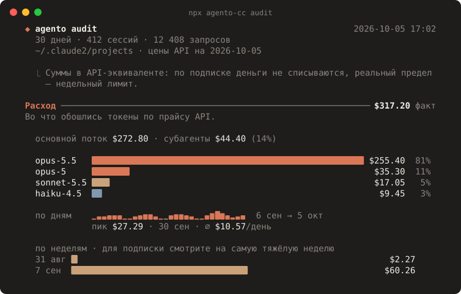
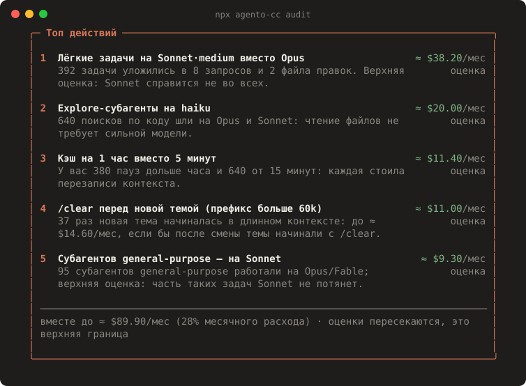

<div align="center">

# ◆ agento

**Тратьте меньше бюджета Claude Code — без потери качества.**

«System 1» для Claude Code. Подбирает модель на старте задачи и отдаёт дешёвую работу дешёвым субагентам.
Передаёт архитектуру от Opus к Sonnet в чистом контексте и останавливает агентов, которые ходят по кругу.
Всё считается в долларах или в процентах недельного лимита, локально.

[English](README.md) · [Исследование](docs/research.md) · [Спецификация](docs/spec-phase-0-1.md) · [План обучения](docs/spec-phase-2-training.md)

</div>

<p align="center"></p>
<p align="center"></p>

> **Статус: альфа.** `agento audit` и плагин уже работают; следующий шаг — обученный классификатор.

## Быстрый старт

Узнать, куда уходит бюджет. Команда читает локальные транскрипты Claude Code и ничего никуда не отправляет:

```sh
npx agento-cc audit            # последние 30 дней
npx agento-cc audit --since all --md report.md
```

Установить плагин (Claude Code ≥ 2.1.287):

```text
/plugin marketplace add <owner>/agento
/plugin install agento@agento
```

## Что делает

| | Сценарий | Почему экономит |
|---|---|---|
| 🎯 | **Модель под задачу.** Лёгкая задача на Opus или effort `max` → на старте подсказка «Sonnet · medium» с кнопкой | Модель выбирается до прогрева кэша, поэтому переключение бесплатно |
| 🏛 | **Архитектор → исполнитель.** Архитектуру обсуждаете с Opus в plan mode, код пишет Sonnet в чистом контексте, где есть только план | Sonnet стартует с 5–10k токенов вместо 100k+ обсуждения |
| 🎼 | **Оркестр субагентов.** Scout (Haiku) читает и ищет, builder (Sonnet) пишет, checker (Haiku) гоняет тесты | У субагентов свой кэш, главный поток остаётся компактным |
| 🧹 | **Гигиена контекста.** Новая тема в длинном контексте → подсказка «сначала /clear» с ценой одного шага | Мёртвый контекст перестаёт перечитываться на каждом шаге |
| 🔁 | **Защита от зацикливания.** Тест падает третий раз, правка-откат по кругу → предупреждение | Застрявший агент — самый дорогой |
| 📊 | **Учёт.** Потрачено, сэкономлено, состояние кэша и темп недельного лимита в строке статуса | Видны деньги, а не счётчики токенов |

## Принципы

1. **Главная модель не меняется посреди задачи.** Кэш не переносится между моделями. Смена на контексте 100k стоит
   ~$0.23 сверху и окупается только через ~10 шагов. Поэтому agento выбирает модель только в «чистых точках»
   (старт сессии, после `/clear` или компакции, остывший кэш) и в субагентах.
2. **Не выше вашего выбора.** agento не поднимает модель или effort выше выбранных вами.
3. **Ничего молча.** У каждой подсказки есть причина и оценка. Каждое авто-действие видно и отменяемо.
4. **Fail-open.** При ошибке или таймауте agento Claude Code работает так, как будто плагина нет.
5. **Доллары, а не токены.** Независимые замеры показывают, что «сжатие токенов» может *повышать* счёт.
   Поэтому мы меряем стоимость решённой задачи.

Почему так: [docs/research.md](docs/research.md). 87% счёта Claude Code — это кэш промптов, а не вывод инструментов.

## Приватность

`agento audit` и плагин работают локально. Промпты, код и статистика не покидают вашу машину.
Будущий облачный классификатор будет только по явному согласию и будет получать только сжатые признаки.

## Дорожная карта

- [x] Исследование и дизайн
- [x] `agento audit`: расход, промахи кэша, TTL, лёгкие задачи на дорогих моделях, субагенты, мёртвый контекст, настройка
- [x] Плагин MVP: учёт, строка статуса, роутинг субагентов, защита от зацикливания, подсказки, передача плана в код, панель `/agento`, автопилот в «чистых точках»
- [x] Конвейер обучения: датасет из вашей истории, судья L1 (любой OpenAI-совместимый сервер), повторные прогоны, публичные метки TwinRouterBench, учитель [Laya](https://github.com/NandhaKishorM/laya) → ученик multilingual-e5-small (35 мс на CPU), демон `agento-brain`
- [ ] Обученный System 1 по умолчанию вместо правил ([инструкция](docs/runbook-gpu.md))
- [ ] Открытый бенчмарк: стоимость решённой задачи против always-Opus, opusplan и роутеров на правилах

## Лицензия

Apache-2.0
